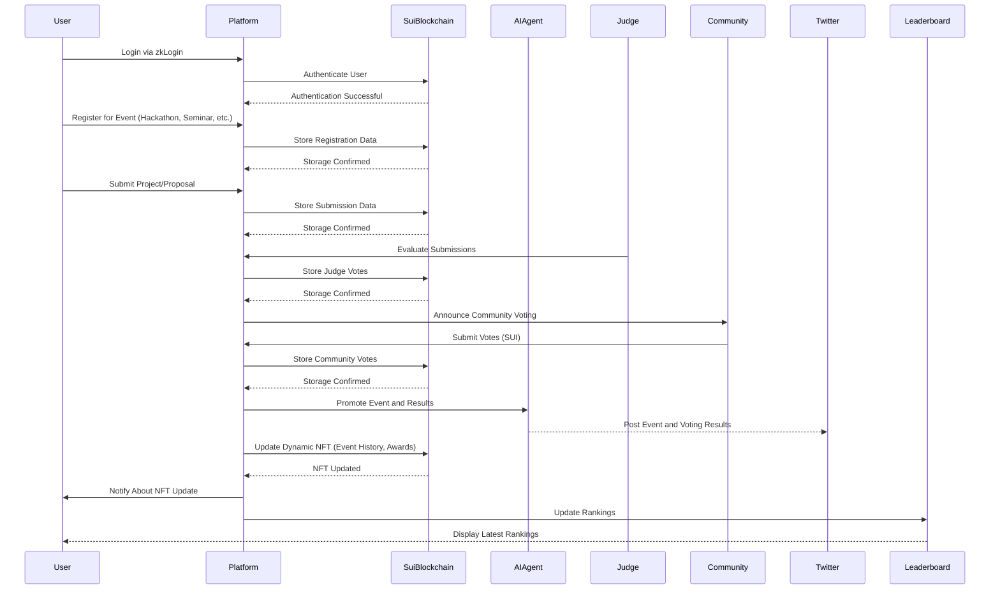

<h1 align="center">SeaYa</h1>
<h3 align="center">Sui ecosystem AI-driven event management platform</h3>

  <a href="https://sea-ya-bice.vercel.app/" style="color: #a77dff">Platform</a> | <a href="https://www.figma.com/deck/6ADbrcMeqD3Tlj5VkoL6F6" style="color: #a77dff">Pitchdeck</a> | <a href="https://youtu.be/YeA-pflC0Tk" style="color: #a77dff">Demo Video</a>

  <a href="https://testnet.suivision.xyz/package/0x0f1687602f8954995944bce0abd292d43181034bec8bc47e8084e9487d624ad1?tab=Code" style="color: #a77dff">Explorer</a> | <a href="https://github.com/chan3785/SeaYa/blob/main/seaya_contract/sources/seaya_contract.move" style="color: #a77dff">Contract Code</a>

## Overview

This platform is designed to streamline event management within the Sui ecosystem, covering hackathons, seminars, conferences, side events, and all official Sui-hosted events. It enables users to register, submit projects or applications, vote, and evaluate submissions in a transparent and decentralized manner. Additionally, the platform automatically promotes events and displays real-time results using an AI agent.

## Problem

### Current Issues in Sui Event Management

1. **Fragmented Registration & Submission**
    - Events like hackathons, conferences, and side events use separate registration systems (e.g., Typeform, Google Forms), leading to inefficiencies.
2. **Limited Visibility**
    - Event promotion is mainly restricted to Twitter and Sui’s blog, reducing community engagement.
3. **Lack of Transparency in Selection & Evaluation**
    - Submissions and evaluations are not publicly accessible, making it difficult for users and judges to track processes.
4. **Minimal Community Participation**
    - The current system limits feedback and participation to organizers and judges, excluding the wider community.

## Solution

This platform addresses these challenges by:

- Providing a **unified system** for registration and participation in all Sui-related events.
- Displaying all submitted applications and projects in a **structured, publicly accessible format**.
- Enabling **community and judge-based evaluation & voting** to ensure fairness.
- Using **AI-powered automation** to promote events and showcase key highlights.
- Storing participation history and awards on **dynamic NFTs** as proof of engagement.

## Key Features

### Unified Event Management System
- Centralized platform for hackathons, conferences, side events, and official Sui programs.
- Secure and verifiable event data stored on the **Sui blockchain**.

### Transparent Project & Application Evaluation
- Event submissions are displayed publicly for easy access by organizers, judges, and the community.
- Organizers can **enable community voting** alongside judge evaluations.

### On-Chain Voting & Decision-Making
- Voting by judges and community members using **SUI, USDC, or USDT**.
- **zkLogin authentication** ensures secure voting and identity protection.

### AI-Powered Event Promotion & Analysis
- AI agent **automatically posts updates** on Twitter and other social media.
- The bot highlights **top projects, key events, and voting results** for better visibility.

### Dynamic NFTs for Event Participation & Achievements
- Users receive **NFT badges** that dynamically update with:
    - Events attended
    - Projects submitted
    - Awards received
    - Ranking and voting results

## User Flow

## Sequence Diagram

## Summary

- This platform **unifies event management** for **all Sui-related events**, including hackathons, seminars, conferences, and side events.
- Users can **register, submit projects, and vote** inQW a decentralized and transparent manner.
- Judges and community members can **evaluate projects and vote using SUI**.
- AI agents handle **event promotion and project highlights** automatically.
- Participants receive **dynamic NFTs** that track their engagement and achievements in the ecosystem.
